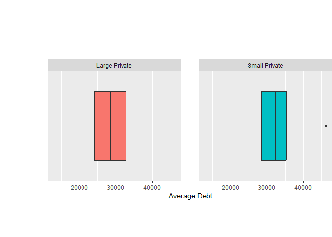
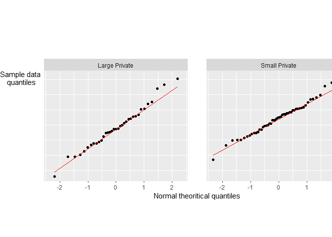

University_Debt: Small V Large
================
Khawaja Hussain Ahmed
2023-10-19

<h2>
Final Report
</h2>

  
  

The purpose of the study is to validate if there is a statistically
significant difference between the average debt of graduates of
small,private universities and graduates of large, private universities.

  
  

We use two independent samples hypothesis testing procedures to answer
this question. To conduct our hypothesis test, we proceed as follows:

  

Suppose that $μ_small$ is the average debt of graduates from small
private universities and $μ_large$ is the average debt of graduates from
large, private universities. If there is a significant difference, then
$μ_small-μ_large>0$. If there isn’t a statistical difference, then
$μ_1-μ_2=0$. So, we set up a null hypothesis $H_0: μ_small-μ_large=0$
and an alternative hypothesis $H_a: μ_small-μ_large>0$.

  

We will use two independent sample t-test for hypothesis testing. We
assume that two samples:(a) average debt for graduates of small, private
universities; and (b) average debt for graduates of large, private
universities were randomly taken from two underlying independent
populations. To conduct our test, we need to check that these two
samples were collected from two normally distributed populations and the
(population) standard deviations of average debt for small,private
universities and large,private universities are equal but unknown. We
draw a side-by-side comparison and plot two box-plots of these two
samples, to find that the sample evidences approximately support the
normality assumptions.

<!-- -->

  
In addition, we produce quantile-quantile (Q-Q) plot for each sample to
check whether the two data sets come from populations with a common
distribution. The Q-Q plots also support the normality assumption about
the populations.  

<!-- -->

  

To check the equality variances, we calculate
$s_small/s_large =5453.599/7034.909=0.78$\`, which lies between 0.5 and
2, so this assumption is also satisfied.

  

The statistical test results found that $t=-2.2974$ and
$P-value= 0.9879$, that is we do not reject $H_0$ and this implies that
there is no statistically significant difference.

  

The average of small,private universities is $\bar{x}=32239.26$ and the
average of large,private universities is $\bar{x}=29124$.

  

In summary, the t-test results suggest that there is not a statistically
significant difference between the means of the groups being compared,
as indicated by the high p-value.
